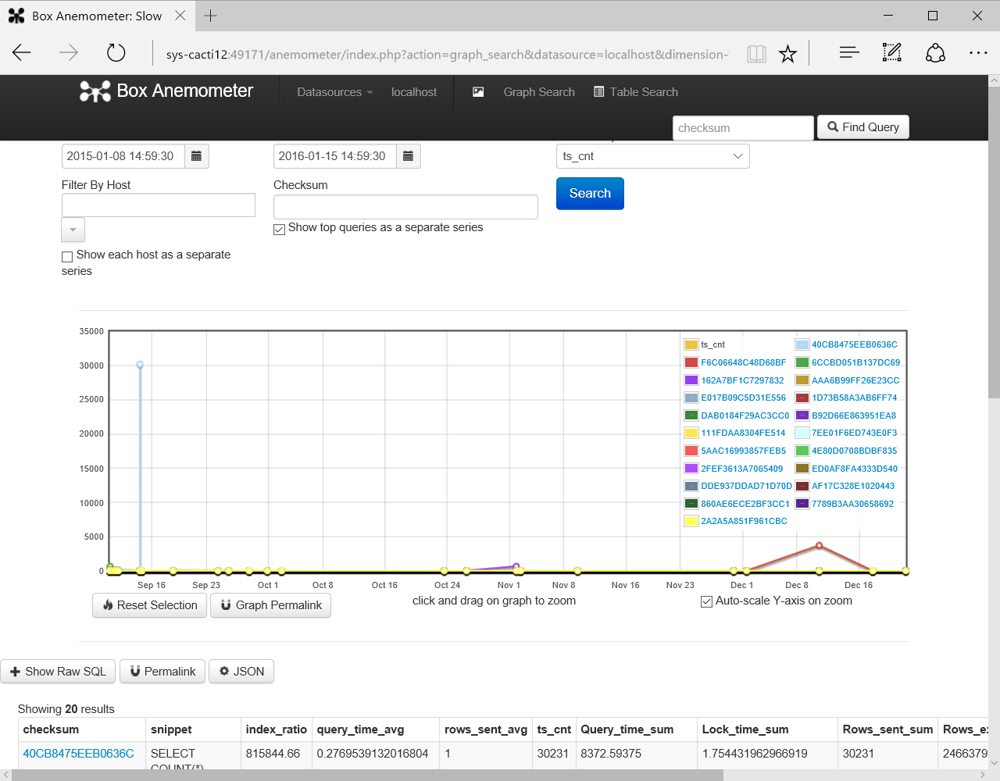
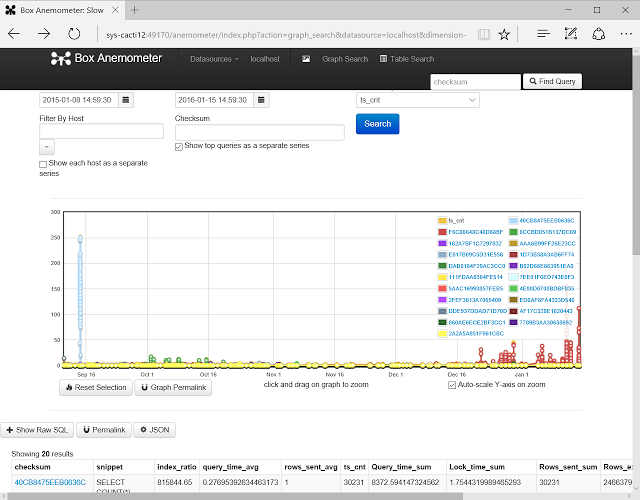

# anemoeater

anemo **eat** erは [box/Anemometer](https://github.com/box/Anemometer) をdockerコンテナーとして起動して、[percona-toolkit](https://github.com/percona/percona-toolkit)の`pt-query-digest`の結果を食わせるためのラッパースクリプトです。

## クイックスタート

* dockerとpercona-toolkitがインストールされている必要があります。

```
$ git clone https://github.com/yoku0825/anemoeater
$ cd anemoeater
$ cpanm --installdeps .
$ ./anemoeater path_to_slow_log
```

* オプションなしの起動では、[yoku0825/anemoeater](https://hub.docker.com/r/yoku0825/anemoeater/)を`docker run`します。
* スローログを分割しながら`pt-query-digest`に食わせます。分割して渡さないとpt-query-digestが(checksum, ts_min, ts_max)という粒度で集計してしまうため、一括で食わせた場合に綺麗なグラフにならないからです（ts_minの時刻にクエリーが集中してプロットされてしまう）
* anemoeaterの起動後にブラウザーからアクセスするためのURLをペロっと吐きます。コンテナーの80番がEXPOSEされてるだけです。
* --sinceと--untilを指定して（ログが多いと重い）スローログを食わせてブラウザで見てコンテナーを止める、みたいな使い方を想定しています。

## 何故anemo **eat** erが必要だったのか

* pt-query-digestはスローログをパースする際に時間の情報を「クエリーが最初に記録された時間からクエリーが最後に記録された時間」に集計してしまうからです。
* それを考慮せずにそのままAnemometerに食わせるとこうなります。Anemometerは時間軸に対してts_minの点でプロットするため、そのクエリーが最初に記録された時刻にいっぱい出たことになってしまいます。



* なのでanemo **eat** erの中でスローログを分割し、(ts_min, ts_max)が綺麗に分かれるようにpt-query-digestを呼び出してAnemometerにインポートさせています。



* あとはAnemometerを使い捨てる（見たくなったら起動、見終わったら破棄）ためにDockerを使っていましたが、毎回インポートするのが面倒になったからです。

## オプション

|オプション   |意味                                                                                       |デフォルト           |
|-------------|-------------------------------------------------------------------------------------------|---------------------|
|--socket=s   |Dockerコンテナーを使わずに既存のAnemometerにスローログを食わせる場合の接続先MySQLソケット  |DBD::mysql依存       |
|--host=s     |Dockerコンテナーを使わずに既存のAnemometerにスローログを食わせる場合の接続先MySQLホスト    |DBD::mysql依存       |
|--port=i     |Dockerコンテナーを使わずに既存のAnemometerにスローログを食わせる場合の接続先MySQLポート    |DBD::mysql依存       |
|--user=s     |Dockerコンテナーを使わずに既存のAnemometerにスローログを食わせる場合のMySQLユーザー        |"anemometer"         |
|--password=s |Dockerコンテナーを使わずに既存のAnemometerにスローログを食わせる場合のMySQLパスワード      |""                   |
|--parallel=i |この数値までフォークして並列でpt-query-digestを起動する                                    |CPUスレッド数 * 1.5  |
|--since=s    |スローログ読み取りの開始時刻（これ以前の時刻のログを読み飛ばす）                           |現在時刻マイナス1か月|
|--unti=sl    |スローログ読み取りの終了時刻（これ以降の時刻のログを読み飛ばす）                           |"9999/12/31"         |
|--report=i   |この数値までpt-query-digestを起動したら標準出力に現在処理中のログ時刻を出力                |15                   |
|--cell=i     |何分単位でログをpt-query-digestに送るか                                                    |5                    |
|--no-docker  |Dockerコンテナーを使わずに既存のAnemometerにスローログを食わせる                           |N/A                  |
|--local      |yoku0825/anemoeaterをpullせず、Dockerfileからローカルホストにanemoeaterイメージをビルドする|N/A                  |
|--binlog     |入力ファイルにスローログではなくバイナリーログを使う                                       |N/A                  |
|--use-docker-for-pt| /usr/bin/pt-query-digestの代わりに yoku0825/percona-toolkit のDockerイメージをを使う|0|


## 引数

* スローログファイルを渡します。複数指定可能。
* スローログファイルの名前がAnemometer上の`hostname_max`になります（Filter By Hostとかで使うやつ）
